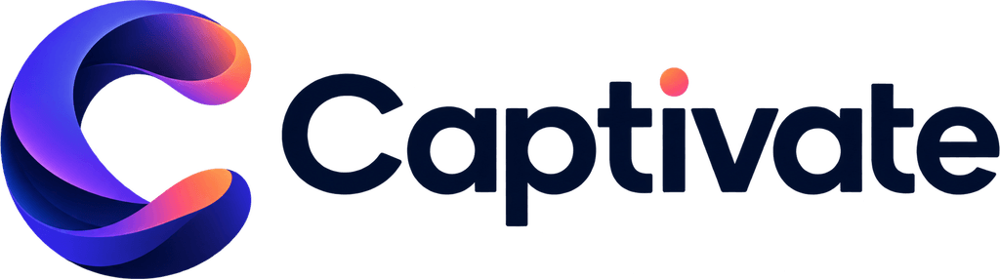

<div align="center">



# Captivate

**Ideas become immersive visual experiences.**


[](https://github.com/athompson83/captivate)

</div>

Captivate is a web application for creating and delivering presentations on an unbounded visual canvas. Instead of treating a presentation as a stack of isolated slides, it places scenes in space and moves a camera through the presenter’s narrative.

```text
Place → Present → Annotate → Record
```

> [!NOTE]
> Captivate is under active beta hardening. Use [`PROJECT_CHECKLIST.md`](PROJECT_CHECKLIST.md) and [`PROGRESS.md`](PROGRESS.md) for current acceptance evidence and blockers; the README is not the release ledger.

## What makes Captivate different

A conventional deck is one arrangement supported by the engine—not the entire model. Scenes may sit in a row, branch, spiral, or nest inside one another. The audience can see where an idea belongs in the larger story while the presenter moves between overview and detail.

## Product capabilities

| Capability | What it provides |
| --- | --- |
| **Place** | Typed scenes, designed layouts, themes, snapping, alignment, drag/resize, undo/redo, autosave, and a spatial journey map |
| **Present** | Dedicated audience stage, separate presenter console, full-screen keyboard control, builds, overview mode, and camera transitions |
| **Annotate** | Laser pointer, highlight, ink, eraser, and session-only overlays that never mutate the saved presentation |
| **Record** | Screen, microphone, and optional camera composition with local download and library upload |
| **Notes** | Concise speaker notes plus long-form lecture notes for research and teaching material |
| **AI** | Prompt → editable narrative map → schema-validated scenes poured into the layout engine as normal editable content |

## Architecture principles

- Audience-only mode (`?audience=1`) contains no presenter-only notes or controls; the standard single-screen presentation route intentionally includes presenter controls.
- AI selects structured content and layout intent; it does not position arbitrary pixels.
- Generated content remains fully editable.
- Annotations are ephemeral presentation-session overlays.
- Recording failures are reported honestly rather than silently discarded.
- Supabase Row Level Security is part of the authorization boundary, not a convenience feature.

## Quick start

```bash
npm install
cp .env.example .env.local
npm run dev
```

Apply the migrations in `supabase/migrations/` in order. See [`docs/DEPLOYMENT.md`](docs/DEPLOYMENT.md) for environment, authentication, and deployment requirements.

## Verification

```bash
npm run format:check
npm run typecheck
npm run lint
npm test
npm run build
npm run test:e2e
npm run test:rls
```

`npm run verify` runs the primary local gate.

## Technology

Next.js 16 · React 19 · TypeScript · Tailwind CSS v4 · Zod · Zustand · Motion · dnd-kit · Supabase Postgres/Auth/Storage · Anthropic SDK · Vitest · Playwright

## Documentation

| Document | Purpose |
| --- | --- |
| [`docs/ARCHITECTURE.md`](docs/ARCHITECTURE.md) | System boundaries and major decisions |
| [`docs/FEATURES.md`](docs/FEATURES.md) | Implemented, partial, and deferred capability |
| [`docs/DESIGN.md`](docs/DESIGN.md) | Visual language and tokens |
| [`docs/UX.md`](docs/UX.md) | Interaction decisions |
| [`docs/DATABASE.md`](docs/DATABASE.md) | Schema, indexes, and RLS |
| [`docs/PRESENTATION_ENGINE.md`](docs/PRESENTATION_ENGINE.md) | Stage, layouts, motion, and auto-fit |
| [`docs/AI_ARCHITECTURE.md`](docs/AI_ARCHITECTURE.md) | Structured generation and fallbacks |
| [`docs/RECORDING.md`](docs/RECORDING.md) | Browser recording boundaries |
| [`docs/SECURITY.md`](docs/SECURITY.md) | Threat model and controls |
| [`docs/TESTING.md`](docs/TESTING.md) | Test strategy and commands |
| [`docs/DEPLOYMENT.md`](docs/DEPLOYMENT.md) | Environment and release operations |
| [`AGENTS.md`](AGENTS.md) | Repository rules for people and agents |

## Brand

The approved Captivate assets live in `public/brand/`. Preserve their proportions and colors; do not recreate, stretch, recolor, or add effects to the wordmark or icon.